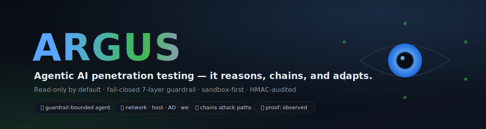
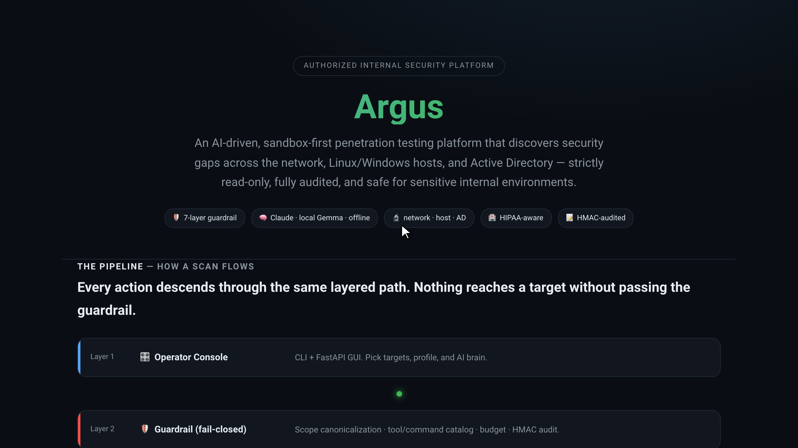
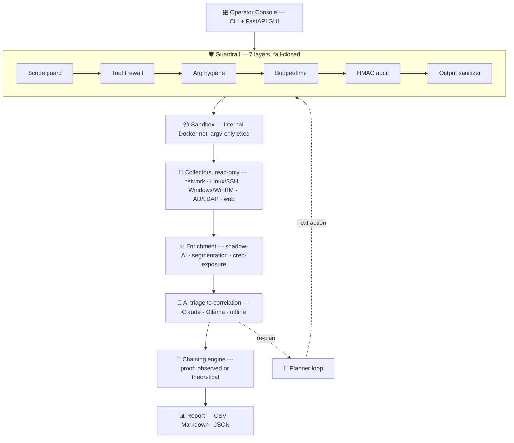
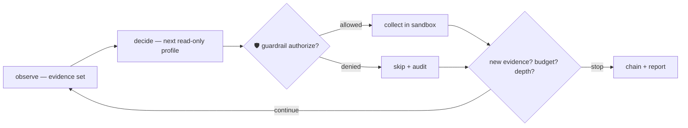

<p align="center"></p>

<p align="center">
  <a href="https://gesh75.github.io/argus/"></a>
</p>
<p align="center"><b><a href="docs/argus_feature_tour.mp4">▶ Watch the 90-second feature tour</a></b> (narrated · guardrail refusal · switchable brain · real Claude + offline scans · HMAC audit) · <a href="docs/argus_real_demo.mp4">short real-scan demo</a> · <a href="https://gesh75.github.io/argus/">architecture site</a></p>

# Argus

> **Point it at an internal network. It reasons, chains, and adapts — read-only by default, behind a fail-closed guardrail.** An agentic AI pentester that turns raw recon into proof-annotated attack paths, strictly inside an authorized scope.


Most "AI pentest" tools are a scanner with a chatbot bolted on: they run a linear checklist and summarize it. **Argus is built the other way around** — every action flows through a 7-layer fail-closed guardrail first, an agent loop decides what to run next from the evidence it has, and a deterministic engine chains findings into multi-step attack paths. The result is safe enough to run near regulated systems and smart enough to find what a checklist misses.

> 🛡️ **Authorized internal security testing only.** Ships with a fully-isolated, intentionally-vulnerable lab — run there first. Live use requires written authorization, a defined CIDR scope, and a regulated-systems exclusion list.

---

## Why it exists

If you have watched an "AI security tool" hallucinate a critical finding with no evidence, or refuse to run anywhere near production because it might break something — this is the antidote.

- **The agent proposes, the guardrail disposes.** Every step the planner chooses is re-authorized by the guardrail: scope, tool firewall, budget, audit. Autonomy can never escape the authorized CIDR, arm an exploit, or touch a denied tool — no matter what the model "reasons."
- **Read-only by default.** No exploitation, credential spraying, writes, or DoS. Credentialed checks use null/guest/audit-mode only. The one component that can emit beyond recon — the PoC verifier — is triple-gated to an isolated lab.
- **Evidence or it didn't happen.** Every attack path is tagged `proof: observed` (every link backed by collected evidence) or `proof: theoretical` (plausible, not yet demonstrated). No silent guesses.
- **Your data stays put.** Switchable AI brain: cloud Claude, local Ollama (data-safe, $0), or a fully offline heuristic engine that always works with no network.
- **Tamper-evident.** Every authorize / exec / deny is written to an HMAC-SHA256 chained audit log; `argus audit` replays and verifies the whole chain.

## How it works

```
targets ─▶ guardrail ─▶ sandbox ─▶ collectors ─▶ AI triage ─▶ chain reasoning ─▶ report
           (fail-       (internal  (network·host  (Haiku→      (observed |        (CSV·MD·
            closed)      Docker)    ·AD·web)        Sonnet)      theoretical)       JSON)
                 ▲                                                   │
                 └────────────── agentic re-plan loop ◀──────────────┘
                        observe → decide next action → AUTHORIZE → collect → repeat
```

The agent only ever proposes a profile to run next; the guardrail authorizes it before anything executes. That single rule is what makes autonomy safe in a sensitive network.

## Architecture



## The agentic loop



## Capabilities

| Domain | What Argus does |
|---|---|
| 🌐 **Network** | 16 read-only tools across 9 profiles — nmap, masscan, nuclei, sslscan, whatweb, enum4linux-ng, smbmap, snmp, ldapsearch |
| 🐧 **Host · Linux** | credentialed SSH audit — SUID/GTFOBins, NOPASSWD sudo, weak sshd, world-writable, Lynis |
| 🪟 **Host · Windows** | WinRM audit — SMB signing, AlwaysInstallElevated, unquoted services, WDigest, UAC, LAPS |
| 🗂️ **Active Directory** | anonymous LDAP enumeration — RootDSE disclosure, null-bind, user enum |
| 🕸️ **Web / API** | curated read-only probe — `.env`, `.git`, actuator, Swagger/OpenAPI surface |
| 🧩 **Segmentation** | flags database / management / directory planes reachable from a user VLAN |
| 🤖 **Shadow-AI** | discovers ungoverned local LLMs/notebooks — Ollama, Jupyter, Gradio, vLLM, vector DBs |
| 🔑 **Credential exposure** | detects GPP cpassword, exposed secrets — reports the **path**, never the secret |
| 🔗 **Chain reasoning** | deterministic decision-trees derive multi-step attack paths with proof annotations |

## Why it's different

| | Typical "AI scanner" | **Argus** |
|---|---|---|
| Safety model | run, then hope | **fail-closed guardrail authorizes every action** |
| Autonomy | linear checklist | **agent re-plans from evidence, still guardrail-bounded** |
| Findings | isolated, often unverified | **chained attack paths, tagged observed/theoretical** |
| AI privacy | cloud-only | **Claude · local Ollama · fully offline** |
| Exploitation | active by default | **read-only; PoC is triple-gated to an isolated lab** |
| Auditability | logs, maybe | **HMAC-chained, tamper-evident, self-verifying** |

## Quickstart

```bash
cd aegis
python3 -m venv .venv && . .venv/bin/activate && pip install -r requirements.txt
export PENTEST_AUDIT_HMAC_KEY=$(openssl rand -hex 32)   # required — refuses to run unaudited
# optional AI: export ANTHROPIC_API_KEY=…   or   export AEGIS_OLLAMA_MODEL=qwen2.5:7b-instruct

# Web console + animated architecture page
uvicorn aegis.web:app --host 127.0.0.1 --port 8800      # http://127.0.0.1:8800

# Or the CLI
python -m aegis scan  172.30.0.10 172.30.0.11 --profile full   # network recon + AI
python -m aegis web   172.30.0.11                              # web/API recon
python -m aegis agent 172.30.0.11 --seed network              # agentic loop
python -m aegis host  172.30.0.20                             # Linux host audit
python -m aegis ad    172.30.0.21                            # AD/LDAP
python -m aegis audit                                       # verify the HMAC chain
```

Out-of-scope or obfuscated targets are refused before anything executes:

```
$ python -m aegis scan 10.0.0.5 --dry-run
REFUSED target 10.0.0.5: scope: 10.0.0.5/32 outside allowed scope
$ python -m aegis scan 167772165 --dry-run     # decimal-encoded 10.0.0.5
REFUSED target 167772165: scope: 10.0.0.5/32 outside allowed scope
```

## The bundled lab

A fully-isolated, intentionally-vulnerable lab to exercise every module safely — on an `internal: true` Docker network with **no route to the host LAN or internet** (proven by `scripts/verify-isolation.sh`).

```
targets/   Juice Shop · DVWA · Samba · misconfigured Linux SSH host · anonymous-bind LDAP · Kali attacker
frrlab/    simulated 2-router OSPF network (FRR, native arm64) for containerlab
scripts/   verify-isolation.sh — proves the lab cannot reach the real LAN/internet
```

```bash
cd targets && docker compose up -d
LAN_GW=192.168.1.1 ../scripts/verify-isolation.sh    # verify isolation FIRST
```

## Security posture

> **Read-only everywhere** except a hard-gated PoC verifier. Credentialed checks use null/guest/audit accounts. WinRM defaults to HTTPS + cert validation; SSH key-auth preferred. Credentials are **never** logged — the audit records only the check + target; secrets and sensitive data are redacted from all output. The PoC runner refuses unless **all three** gates pass: armed (`--arm poc`) **and** target inside `AEGIS_LAB_NET` **and** `AEGIS_POC_CONFIRM_ISOLATED=1`. Before any live use: written authorization + CIDR scope + exclusions for regulated systems. See [`aegis/SECURITY.md`](aegis/SECURITY.md).

## Tests

75 passing — guardrail (22), agent/chains/planner/PoC (17), Windows+AD (8), web recon (8), recon modules (8), Linux host (6), heuristics (4), end-to-end integration (2).

```bash
cd aegis && PENTEST_AUDIT_HMAC_KEY=test python -m pytest -q
```

## Docs

- [`aegis/docs/AGENTIC_ROADMAP.md`](aegis/docs/AGENTIC_ROADMAP.md) — the agentic design and module map
- [`aegis/BUILD_AND_TEST_LOG.md`](aegis/BUILD_AND_TEST_LOG.md) — full build + live-validation record
- [`aegis/SECURITY.md`](aegis/SECURITY.md) — the strict posture contract
- **Live page:** the animated architecture guide is served at `/architecture` by the web console

---

<p align="center"><sub>Argus · authorized internal security testing only · the agent proposes, the guardrail disposes</sub></p>
