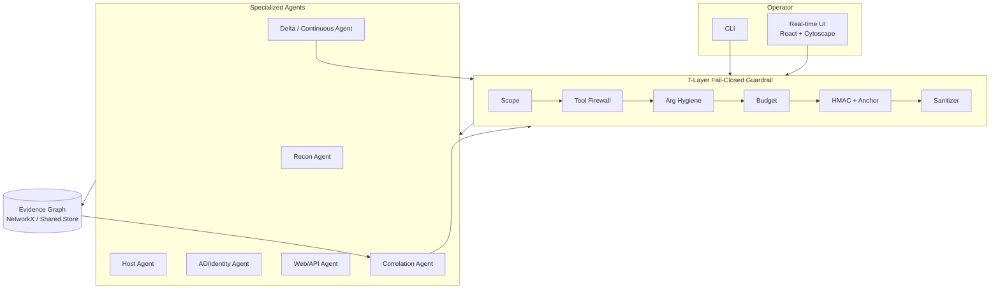

# Argus V2 — Continuous Self-Defense Sensor Fabric

> **Status: experimental architecture/scaffolding.** This document describes the V2 target
> state, not current production behavior. Argus is not approved for unattended, production,
> regulated, or 24/7 operation.

**Status:** Implementation started on branch `feature/argus-defender-fabric-v2`  
**Principle (inviolable):** The agent proposes. The Guardrail disposes.

## Elevated Purpose

The target architecture is a **Continuous Authorized Self-Defense Sensor** for the gesh75
Network AI Defender Fabric. That target has not yet been achieved.

## High-Level Architecture

## Evidence Graph Model
Every observation is a node. Attack paths are edges with proof tags (`observed` | `theoretical`).

## Continuous Mode
Scheduled runs produce a delta graph: new paths, closed paths, changed confidence.

## Safety Contract
All agents still call `Guardrail.authorize()` before any collector runs.  
No agent can ever bypass the 7 layers.
