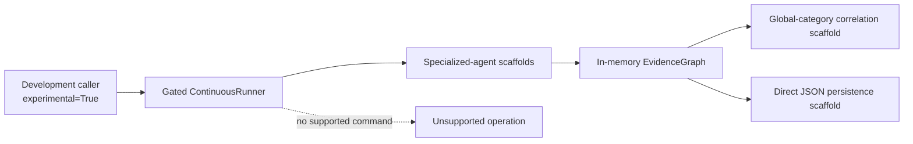

# Argus V2 Experimental Architecture

> **Target architecture, not current product behavior.** V2 is explicitly
> gated, has no supported CLI entry, and is not approved for unattended,
> production, regulated, network-exposed, multi-user, or 24/7 operation.

## Current scaffold

```mermaid
flowchart LR
    OP["Development caller<br/>experimental=True"] --> CR["Gated ContinuousRunner"]
    CR --> SA["Specialized-agent scaffolds"]
    SA --> EG["In-memory EvidenceGraph"]
    EG --> CA["Global-category correlation scaffold"]
    EG --> JP["Direct JSON persistence scaffold"]
    CR -. "no supported command" .-> X["Unsupported operation"]
```

Current deficiencies are binding:

- `BaseAgent.run_authorized()` authorizes but does not execute a collector or
  record observations.
- Recon proposes an empty target set; Host, AD, and Web propose nothing.
- Targetless proposals are skipped and broad exceptions are suppressed.
- Correlation is not asset-bound and path identifiers are random.
- Persistence is not versioned, locked, atomic, checksummed, strict, or
  recoverable.
- New/changed/closed path semantics are not an operational lifecycle.

## Target foundation

```mermaid
flowchart LR
    OP["Explicit operator targets"] --> P["Typed proposal"]
    P --> G["Existing fail-closed Guardrail"]
    G --> C["Existing bounded collector"]
    C --> O["Normalized observation"]
    O --> EG["EvidenceGraph"]
    EG --> AC["Asset-bound correlation"]
    AC --> DI["Deterministic identity + dedupe"]
    DI --> TP["Transactional persistence"]
    TP --> D["Truthful delta report"]
```

No part of the target flow may bypass the existing guardrail, synthesize model
shell commands, hide an exception, or default to loop mode. The binary exit
criteria are in [`control/ROADMAP.md`](control/ROADMAP.md).
