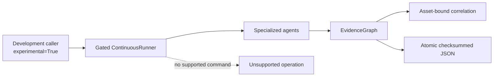
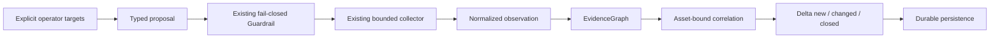

# Argus V2 Experimental Architecture

> **Target architecture, not a supported product.** V2 is explicitly
> gated, has no supported CLI entry, and is not approved for unattended,
> production, regulated, network-exposed, multi-user, or 24/7 operation.

## Current experimental path

```mermaid
flowchart LR
    OP["Development caller<br/>experimental=True"] --> CR["Gated ContinuousRunner"]
    CR --> SA["Specialized agents"]
    SA --> EG["EvidenceGraph"]
    EG --> CA["Asset-bound correlation"]
    EG --> JP["Atomic checksummed JSON"]
    CR -. "no supported command" .-> X["Unsupported operation"]
```

Current experimental capabilities, still unsupported as a product:

- `BaseAgent.run_authorized()` authorizes, then executes an injected collector
  and records observations.
- Recon proposes operator-supplied targets; Host, AD, and Web propose only
  when evidence warrants a follow-up, and stop once that kind exists.
- Targetless proposals are skipped; broad exception suppression was removed,
  and collector failures now propagate.
- Correlation is asset-bound and path identifiers are deterministic.
- Persistence is schema-versioned, atomic, and checksummed. Checksum mismatch
  loads an empty graph. This is not WORM.
- Closed-path semantics are reported by `DeltaAgent` and `ContinuousRunner`.

## Target foundation

```mermaid
flowchart LR
    OP["Explicit operator targets"] --> P["Typed proposal"]
    P --> G["Existing fail-closed Guardrail"]
    G --> C["Existing bounded collector"]
    C --> O["Normalized observation"]
    O --> EG["EvidenceGraph"]
    EG --> AC["Asset-bound correlation"]
    AC --> D["Delta new / changed / closed"]
    D --> S["Durable persistence"]
```

The agent proposes. The guardrail disposes. That sentence is not aspirational
for V2 either: specialized agents never skip `Guardrail.authorize()`.
