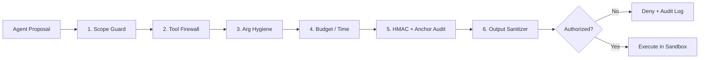
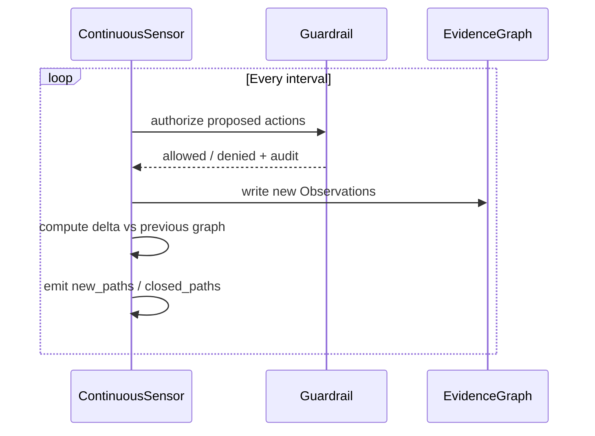

# Argus V2 — Complete Feature Documentation

**Extensive explanation of every major feature with diagrams.**

---

## 1. 7-Layer Fail-Closed Guardrail (The Sacred Core)

**Why it exists**  
Autonomy without a hard reference monitor is dangerous near regulated systems. Every single action is re-authorized. Ambiguity always equals denial. This is the reason Argus can be left running as a continuous sensor.

---

## 2. Evidence Graph

Central shared knowledge plane used by all agents.

- Nodes = Observations (network, host, AD, web, exposure, segmentation, ai-service, path)
- Edges = causal / chaining relationships
- Every attack path carries a mandatory proof tag: `observed` or `theoretical`

This is the primary defense against LLM hallucination.

---

## 3. Specialized Multi-Agent System

| Agent              | Responsibility                                   | Under Guardrail |
|--------------------|--------------------------------------------------|-----------------|
| ReconAgent         | Network scanning, segmentation, shadow-AI        | Yes             |
| HostAgent          | Linux & Windows read-only audits                 | Yes             |
| ADAgent            | Anonymous LDAP / identity surface                | Yes             |
| WebAgent           | Web / API surface discovery                      | Yes             |
| CorrelationAgent   | Builds multi-step attack paths from the graph    | Yes             |
| DeltaAgent         | Continuous mode change detection                 | Yes             |

---

## 4. Continuous / Delta Mode

Turns Argus from a one-shot scanner into a true continuous self-defense sensor for the gesh75 fabric.

---

## 5. Proof Annotation Discipline

Every attack path must be tagged:

- **observed** → every link is backed by collected evidence
- **theoretical** → plausible but not yet demonstrated

This single rule is the antidote to hallucinated findings.

---

## 6. Privacy Options

- Claude (cloud) for non-sensitive work
- Local Ollama for PHI / regulated networks
- Fully offline heuristic engine as fallback

---

## 7. Tamper-Evident Audit

HMAC-SHA256 chained log + optional external WORM anchor.  
The entire history can be verified with `argus audit`.

---

## Design Principle (Never Broken)

> **The agent proposes. The Guardrail disposes.**

This is what makes Argus safe enough to be the continuous eyes of the gesh75 Network AI Defender Fabric.
